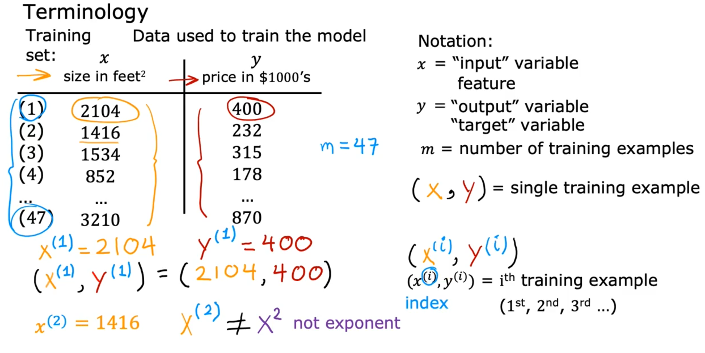

# Artificial Intelligence

## Supervised Learning

### Regression

模型用于预测连续数值型的输出，例如房价、股票价格等；

1. Linear Regression（线性回归）：通过拟合一个直线或超平面来预测连续数值型的输出，它是最常用的 regression 模型之一。
2. Polynomial Regression（多项式回归）：将线性回归模型扩展到高维特征空间，用多项式函数来拟合数据。
3. Ridge Regression（岭回归）：在线性回归的基础上添加一个 L2 正则化项，以避免过拟合问题。
4. Lasso Regression（套索回归）：在线性回归的基础上添加一个 L1 正则化项，以促使一些系数变成零，从而可以进行特征选择。
5. Elastic Net Regression（弹性网络回归）：是 Ridge Regression 和 Lasso Regression 的结合，同时使用 L1 和 L2 正则化项。

### Classification

用于分类或预测离散的输出，例如判断一封邮件是否为垃圾邮件、图像识别中判断一张图片中的对象是猫还是狗等。

## Unsupervised Learning

### Clustering（聚类）

将数据分成不同的组或簇，每个组内的数据具有相似的特征，而不同组之间的数据则有明显的区别。

### Dimensional reduction（降维）

将高维数据转换为低维数据，同时保留数据的关键特征，以便更好地进行数据分析和可视化。

### Anomaly detection（异常检测）

寻找那些与其他数据不同的数据点，这些点可能代表着数据中的异常情况或错误。

## Common Notations in Machine Learning

x = "input variable(feature or input feature)"

y = "output variable(target variable)"

m = number of train examples

(x, y) = single training example

x&#8317;&#x2071;&#8318;y&#8317;&#x2071;&#8318; = i&#8317;&#x1D57;&#x02B0;&#8318; training example 

&ycirc; =  x -> f  -> y hat 通过算法推测出的y

### 

mean-squared-error-cost-function