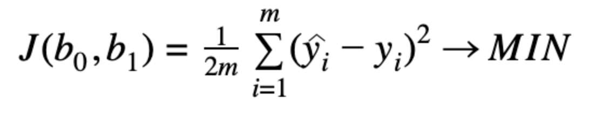
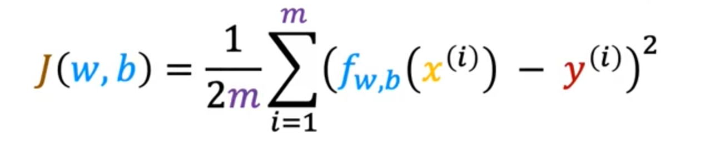

# Explanation of terms

-  fitting a straight line 拟合一条直线

- hypothesis（假设）通常指的是机器学习模型所建立的函数或模型，用于将输入数据映射到输出结果。简单来说，hypothesis 就是机器学习算法所学习到的关于输入和输出之间关系的假设或模型。在监督学习中，hypothesis 用于预测输出结果，而在无监督学习中，hypothesis 通常用于解释数据的结构和模式。

  例如，在线性回归中，hypothesis 就是通过拟合一条直线来建立的函数，用于将输入数据（如房屋大小）映射到输出结果（如房价）。在分类问题中，hypothesis 可以是通过学习到的分类器，用于将输入数据（如图像）映射到离散的输出类别（如猫或狗）。

- Linear regression with one variable = Univariate linear regression
- Univariate = One variable 

- mean-squared-error-cost-function(平方误差成本函数)

  

